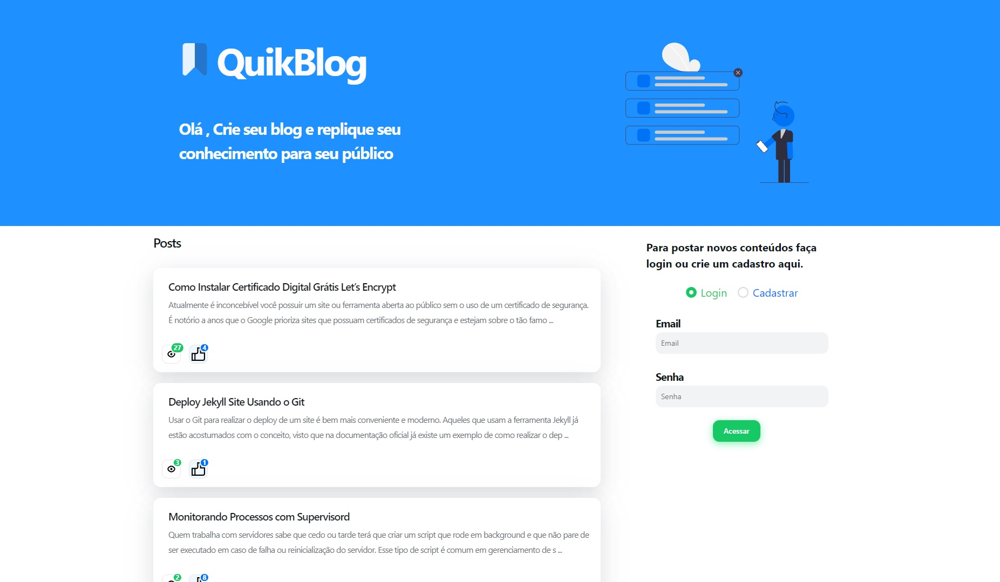

# :gear: QuikBlog

Aplicada criada em React (CRA) usando NextUI (UI) e Stiches (css).

## :gear: Descrição
Aplicação para criação de posts simulando um blogs, com funcionalidades de curtir, visualizar e criar POST.

Esta aplicação está hospedada na Vercel e o Backend na AWS.
- Demo: <a href="https://react-movies-seven-rho.vercel.app" target="_blank">Clique aqui</a>

## :gear: Techs utilizadas

- React JS
- Next UI
- Typescript
- Stiches
